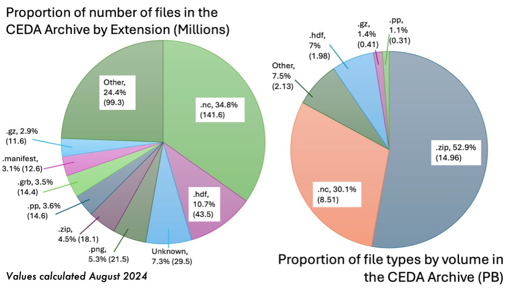

Inspiration for Cloud Formats and Aggregations
==============================================

Data Archives
-------------

The need for cloud-accessible analysis-ready data is increasing due to high demand for cloud-native applications and wider usability of data.
Current archival formats and access methods are insufficient for an increasing number of user needs, especially given the volume of data being
produced by various projects globally. 

The CEDA-operated JASMIN data analysis facility has a current (2024) data archive of more than 30 Petabytes, with more datasets being ingested 
daily. Around 25% of all datasets are in NetCDF/HDF formats which are well-optimised for HPC architecture, but do not typically perform as well 
and are not as accessible for cloud-based applications. The standard NetCDF/HDF python readers for example require direct access to the source
files, so are not able to open files stored either in Object Storage (S3) or served via a download service, without first downloading the whole file.

Distributed Data
----------------

The aim of distributed data aggregations is to make the access of data more effective when dealing with these vast libraries of data.
Directly accessing the platforms, like JASMIN, where the data is stored is not necessarily possible for all users, and we would like to avoid the dependence
on download services where GB/TBs of data is copied across multiple sites. Instead, the data may be accessed via a **reference/aggregation file** which provides
the instructions to fetch portions of the data, and applications reading the file are able to load data as needed rather than all at once (Lazy Loading).

Formats which provide effective remote data access are typically referred to as **Cloud Optimised Formats** (COFs) like `Zarr <https://zarr.readthedocs.io/en/stable/>`_ and `Kerchunk <https://fsspec.github.io/kerchunk/>`_, as in the diagram above. 
Zarr stores contain individual **binary-encoded** files for each chunk of data in memory. Opening a Zarr store means accessing the top-level metadata which 
informs the application reader how the data is structured. Subsequent calls to load the data will then only load the appropriate memory chunks. Kerchunk
functions similarly as a pointer to chunks of data in another location, however Kerchunk only references the existing chunk structure within NetCDF files,
rather than having each chunk as a separate file. 

PADOCC supports an additional format called CFA, which takes elements of both of these methods. CFA files store references to portions of the array, rather than ranges of bytes of compressed/uncompressed data like with Kerchunk. 
These references are stored in NetCDF instead of JSON metadata files, which has the advantage of lazily-loaded references from a single file. Read more about CF Aggregations `here <https://cedadev.github.io/CFAPyX/>`_. 

A workflow for data conversion
------------------------------

PADOCC is a tool being actively developed at CEDA to enable large-scale conversion of archival data to some of these new cloud formats, to address the issues above.
Originally created as part of the ESA Climate Change Initiative project, PADOCC is steadily growing into an essential part of the CEDA ingestion pipeline.
New datasets deposited into the CEDA archive will soon be automatically converted by PADOCC and represented as part of the growing STAC catalog collection at CEDA.
Use of the catalogs is facilitated by the `CEDA DataPoint <https://cedadev.github.io/datapoint/>`_ package, which auto-configures for multiple different file types.

The result of this new data architecture will be that users of CEDA data can discover and access data through our packages much faster and more efficiently than before,
without the need to learn to use many new formats. All the nuances of each dataset are handled by DataPoint, and use products created by PADOCC to facilitate fast search/access
to the data.

