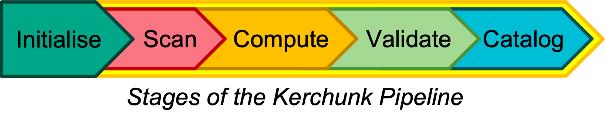

Overview of Pipeline Phases
===========================

**Init (Initialisation) Phase**

The Kerchunk pipeline takes a CSV (or similar) input file and creates the necessary directories and config files for the pipeline to being running.

**Scan Phase**

Second phase of the pipeline involves scanning a subset of the NetCDF/HDF/Tiff files to determine certain parameters:

* Ensure NetCDF/HDF/Tiff files can be converted successfully using one of the available drivers:
* Calculate expected memory (for job allocation later.)
* Calculate estimated chunk sizes and other values.
* Determine file-type (JSON or Parquet) for final Kerchunk file.
* Identify Identical/Concat dims for use in **Compute** phase.
* Determine any other specific parameters for the dataset on creation and concatenation.

**Compute Phase**

Building the Kerchunk file for a dataset requires a multi*step process:

* Create Kerchunk references for each archive-type file.
* Save cache of references for each file prior to concatenation.
* Perform concatenation (abort if concatenation fails, can load cache on second attempt).
* Perform metadata corrections (based on updates and removals specified at the start)
* Add Kerchunk history global attributes (creation time, pipeline version etc.)
* Reconfigure each chunk for remote access (replace local path with https:// download path)

**Validation Phase**

Kerchunk files must be validated against equivalent Xarray objects from the original NetCDF:

* Ensure all variables present in original files are present in Kerchunk (barring exceptions)
* Ensure array shapes are consistent across Kerchunk/NetCDF
* Ensure data representations are consistent (values in array subsets)

Several options and switches can be configured for the validation step, see the BypassSwitch class.

**Next Steps**

Kerchunk files that have been validated are moved to a ``complete`` directory with the project code as the name, plus the kerchunk revision `krX.X`. These can then be linked to a catalog or ingested into the CEDA archive where appropriate.
